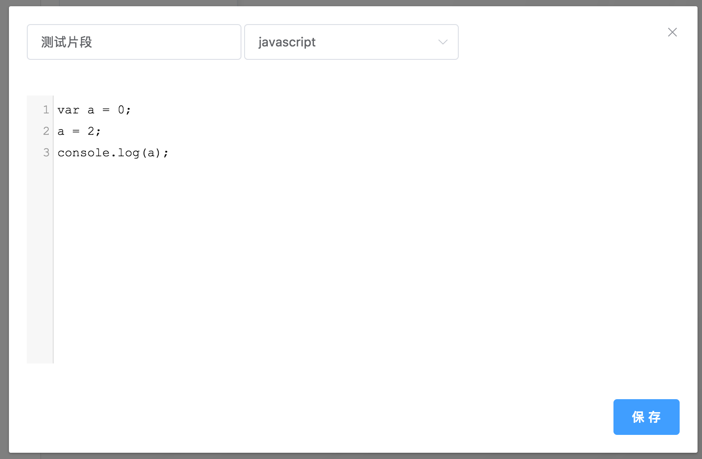
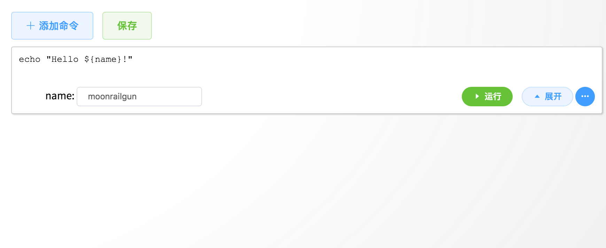
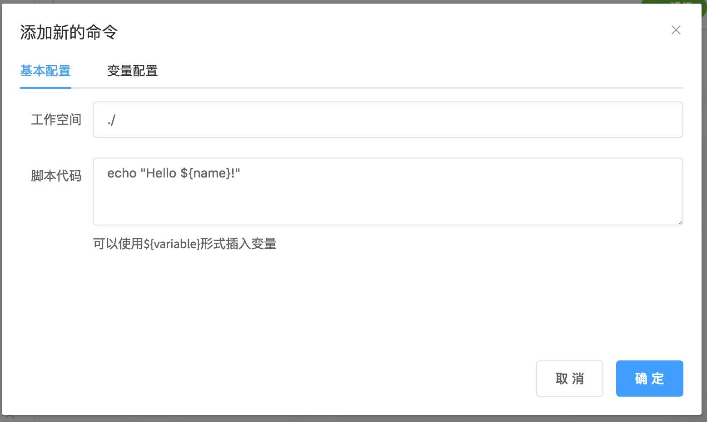
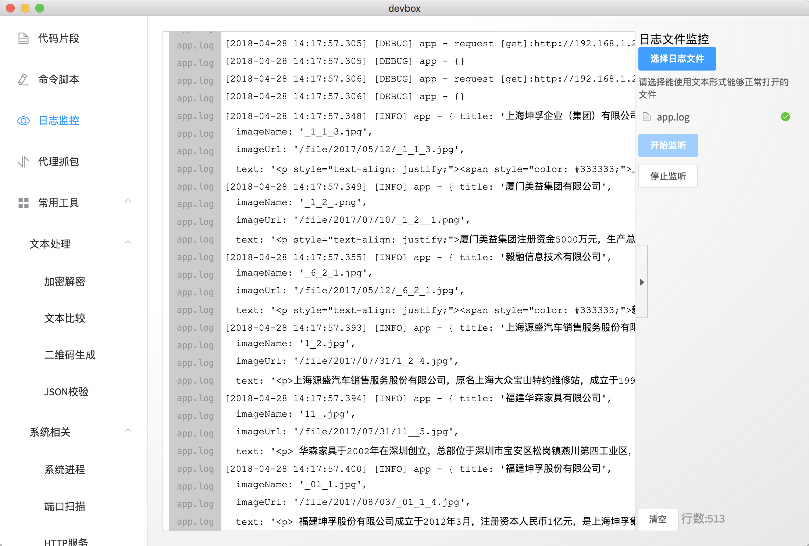
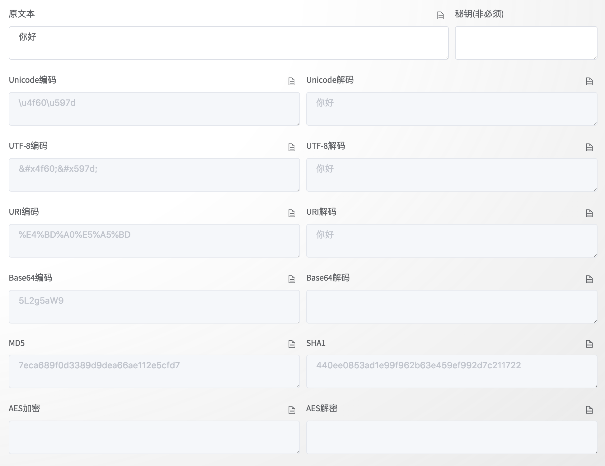
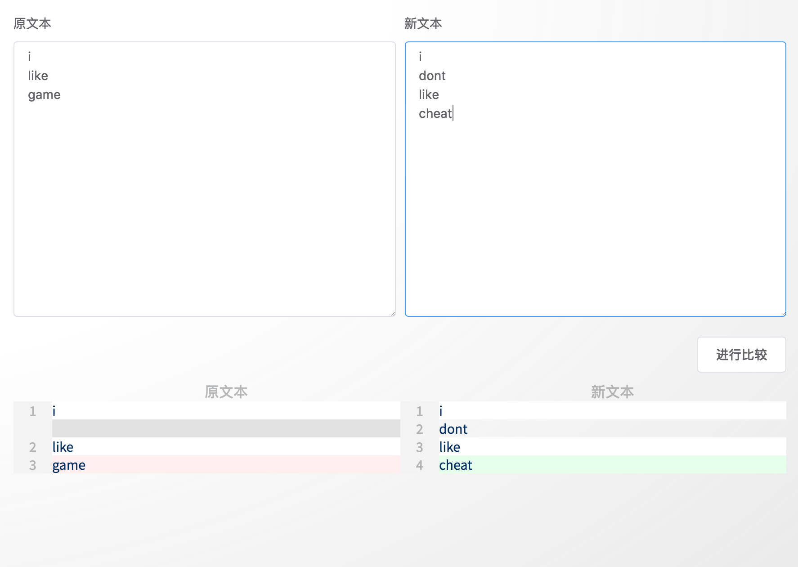
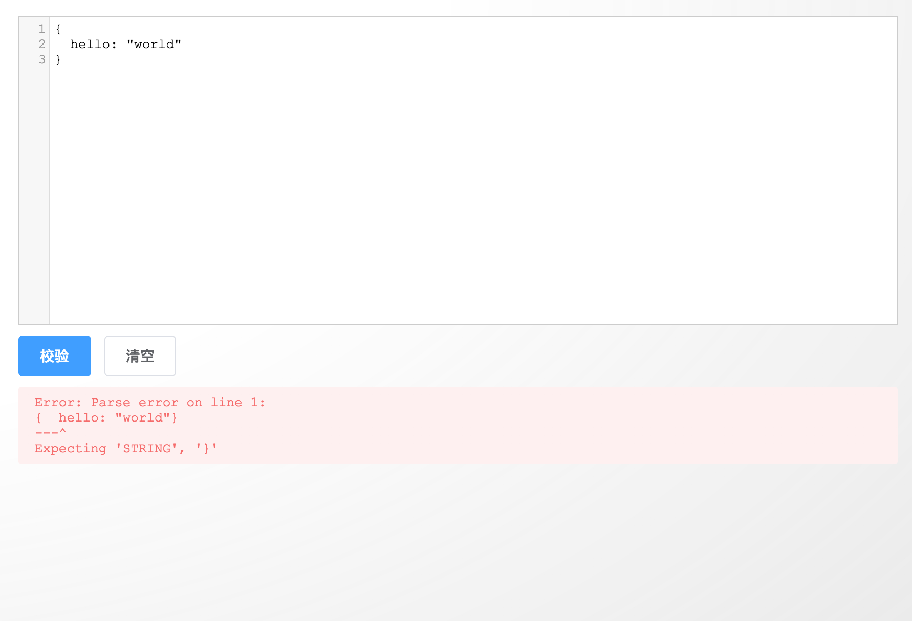
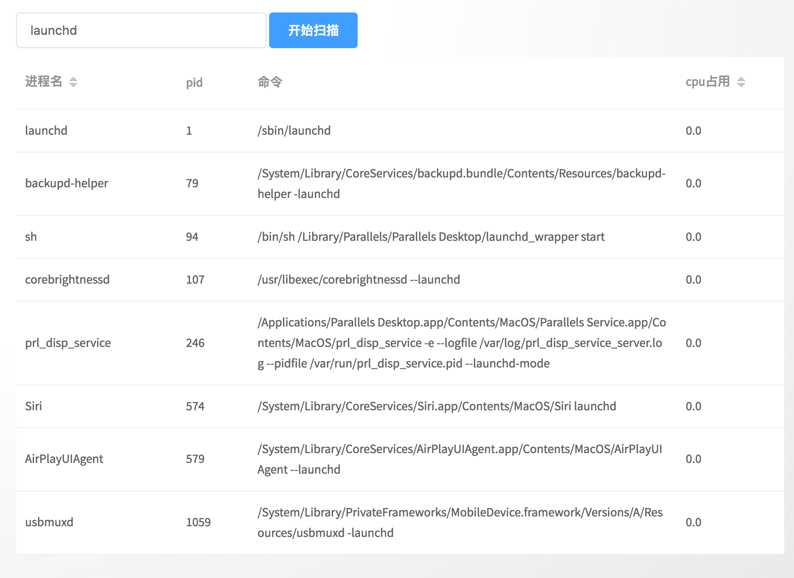
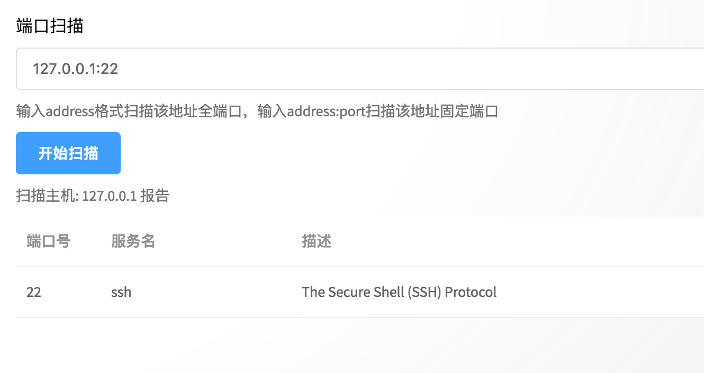
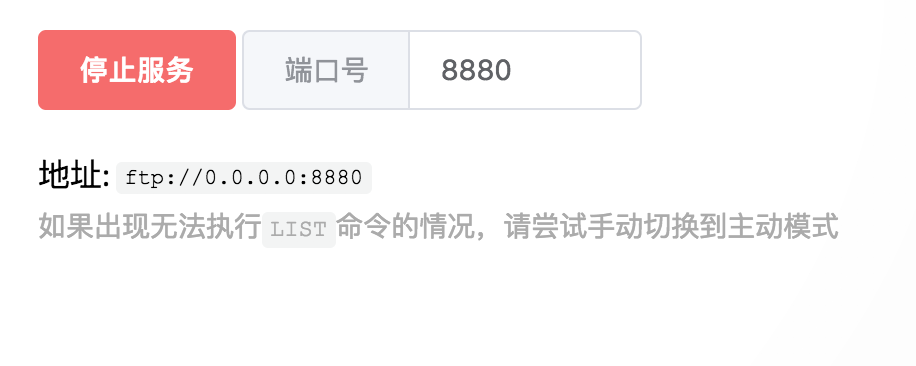

# devbox

> 一款集成程序员常用软件的工具箱应用

[](https://github.com/moonrailgun/devbox/releases)
[](https://github.com/moonrailgun/devbox/releases)
[](https://ci.appveyor.com/project/moonrailgun/devbox)

## 功能模块

- [x] [代码片段](#代码片段)
- [x] [命令脚本](#命令脚本)
- [x] [日志监控](#日志监控)
- [x] [代理抓包](#代理抓包)
- 常用工具
  - 文本处理
    - [x] [加密解密](#加密解密)
    - [x] [文本比较](#文本比较)
    - [x] [二维码生成](#二维码生成)
    - [x] [JSON校验](#JSON校验)
  - 系统相关
    - [x] [系统进程](#系统进程)
    - [x] [端口扫描](#端口扫描)
    - [x] [HTTP服务](#HTTP服务)
    - [x] [FTP服务](#FTP服务)
- [x] 系统设置


## 编译步骤

``` bash
# install dependencies
npm install

# serve with hot reload at localhost:9080
npm run dev

# build electron application for production
npm run build
# or npm run build:dir

# run unit & end-to-end tests
npm test


# lint all JS/Vue component files in `src/`
npm run lint

```

## 功能描述

#### 代码片段

一个代码片段的管理应用部件, 用户创建、编辑、保存、管理用户的一些常用代码片段。

- [x] 片段命名
- [x] 片段选择语言与自定义语言
- [x] 片段预览
- [x] 片段编辑
- [x] 片段保存
- [x] 片段添加到剪切板




#### 命令脚本

一个管理常用命令的部件，支持自定义变量  
编辑后记得点击保存按钮保存变更  

- [x] 添加命令
- [x] 定义工作空间
- [x] 定义变量空间
- [x] 删除命令
- [x] 运行命令
- [x] 保存命令




#### 日志监控

一个用户监控日志文件修改的应用，可以最高同时监控三个文件  
因为过多的日志记录会使应用较为卡顿因此设定最大保留日志行数(默认为1000行)



#### 代理抓包

详见 [AnyProxy](https://github.com/alibaba/anyproxy)  
默认端口:
> 代理服务:`8001`  
> 网页服务:`8002`

#### 加密解密

加密/解密字符串的各种算法格式，目前支持的算法有如下几种常见的算法:
- `Unicode`
- `UTF-8`
- `URI`
- `Base64`
- `MD5`
- `SHA1`
- `AES`(需要提供秘钥)



#### 文本比较

快速比较两段文字的差异，高亮形式表现出差异段落



#### 二维码生成

快速生成二维码  
常用于生成网页到手机端


#### JSON校验
用于JSON校验, 可以格式化不正确的JSON格式的字符串, 并指出不正确的地方  
也可以用于美化JSON字符串



#### 系统进程
列出系统进程的:
- 进程名
- pid
- 命令
- cpu占用

并支持过滤匹配项, 与列表排序



#### 端口扫描
扫描目标ip(域名)监听的tcp端口  
用法:
- `127.0.0.1` 扫描本地所有的端口情况(1~65535)
- `127.0.0.1:22` 扫描本地22端口情况



#### HTTP服务
开放一个简易的静态http服务


#### FTP服务
开放一个简易的ftp服务  
如果无法正常列出目录, 请尝试手动指定为主动模式



---

This project was generated with [electron-vue](https://github.com/SimulatedGREG/electron-vue) using [vue-cli](https://github.com/vuejs/vue-cli). Documentation about the original structure can be found [here](https://simulatedgreg.gitbooks.io/electron-vue/content/index.html).

<div>
<style>
.markdown-body img {
  box-shadow: 0 0 4px 0px #ccc;
}
</style>
</div>
